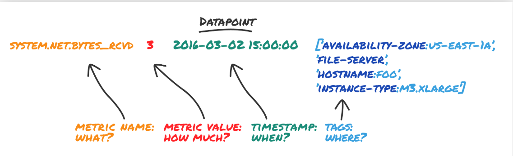
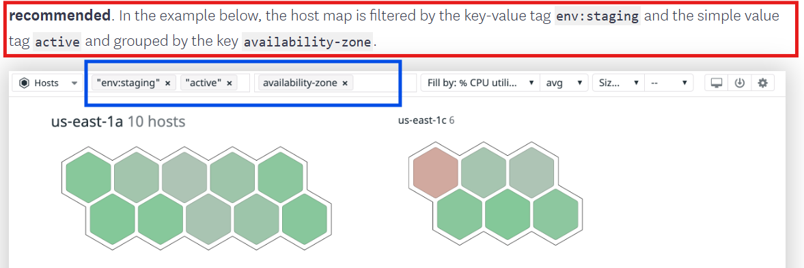
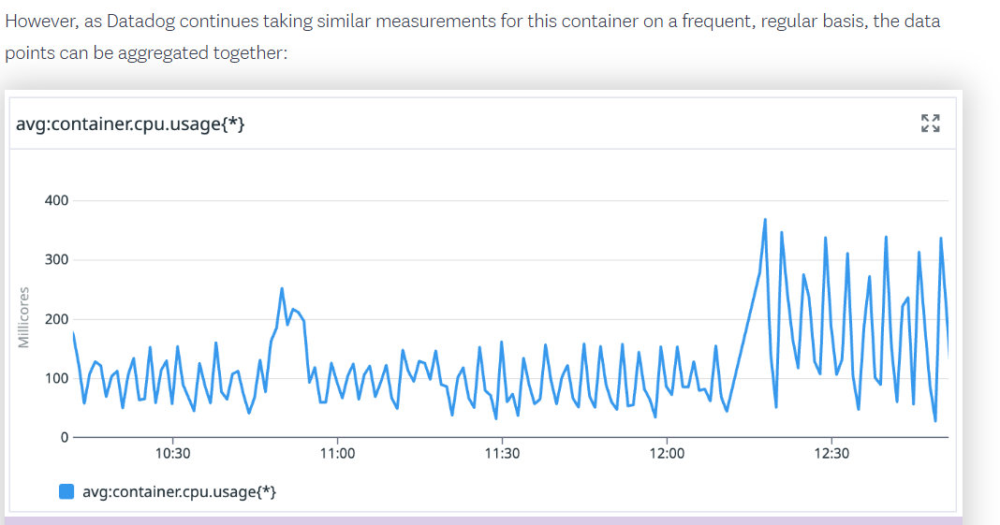

# Core Skills

## Introduction to Tags

- **Tags** are labels that can be attached to your data to add context
    - so that you can filter, group, and correlate your data throughout Datadog. 
       Tags help you optimize your monitoring workflows

- **datapoint** : 
    - In Datadog, each datapoint includes a name or identifier, a value, a timestamp, and the assigned tags. Tags can be either simple values or key-value pairs

    - In the example datapoint below, the tag file-server is a simple value and the tags availability-zone:us-east-1a, hostname:foo, and instance-type:m3.xlarge are key-value pairs.

    

-  **`Simple value tags`** : Can only be used to filter datapoints 

- **`key-value pair tags`** : Can be used to group datapoints as well as filter them


| Tag Format        | Examples                | Can be used to filter, group?                  |
|-------------------|-------------------------|-------------------------------------------------|
| Simple Value      | staging, demo           | Filter                                          |
| Key-Value Pair    | env:staging, env:demo   | Filter - using key:value, Group - using key     |



- **Note** : 
    - In Datadog, there are “reserved” tag keys that are used to correlate metric, trace, and log data throughout Datadog.
    
    - Reserved tag keys  should only be assigned for their defined purposes and should be used consistently wherever you use them

    - `Unified Service Tagging` : **(The reserved keys env, service, and version)** allows you to scope data for an environment and service by deployment versio


| Reserved Tag Key  |                               Used for                                   |
|-------------------|--------------------------------------------------------------------------|
| host              | Correlation between metrics, traces, processes, and logs                 |
| device            | Segregation of metrics, traces, processes, and logs by device or disk    |
| source            | Span filtering and automated pipeline creation for Log Management        |
| env               | Scoping of application specific data across metrics, traces, and logs    |
| service           | Scoping of application specific data across metrics, traces, and logs    |
| version           | Scoping of application specific data across metrics, traces, and logs    |
| team              | Assign ownership to any resources                                        |


## Introduction to Metric

- consistently tracking and aggregating measurements over time can reveal meaningful patterns.

- In Datadog, these consistent measurements are called **metrics**. `Metrics` are numerical values that track changes in an environment over time. They can represent a wide range of data, including latency, error rates, request durations, CPU utilization, or even business-specific metrics like user registrations and subscriptions.

### Metric Format
metric measurement contains a timestamp and a value
```bash
12 Dec 2024 22:42:51 - 65.63
```



- Datadog can collect, aggregate, display, and alert on a large number of different metrics


| Datadog Metrics Sources                                      |
|-------------------------------------------------------------|
| The Datadog Agent                                           |
| Agent-based integrations                                     |
| DogStatsD                                                  |
| Datadog Integrations                                        |
| Other areas of the Datadog platform                         |
| Real User Monitoring (RUM)                                  |
| Application Performance Monitoring (APM)                    |
| Logs                                                       |
| Processes                                                  |
| Events                                                     |
| The Datadog API                                            |


### The Datadog Agent

the **Agent** is often the first source from which you receive metrics.
The Agent automatically sends a collection of standard metrics to Datadog. These can include:


| Host-Level Metrics       | Container Metrics       | APM Metrics         | Network Metrics       |
|--------------------------|-------------------------|----------------------|-----------------------|
| CPU Usage                | Container CPU           | Service Latency      | TCP Connections        |
| Memory Usage             | Container Memory        | Request Volume       | DNS Queries           |
| Disk Usage               | Container Disk I/O      | Error Rates          |                       |
| Disk I/O                 | Container Network Metrics |                      |                       |
| Network Traffic          |                         |                      |                       |

### Other Datadog tools

#### Log-based Metrics
You can extract and generate metrics from logs, to help quantify and summarize the data within them.

- example:
    *  Number of HTTP requests
    *  Total API calls
    *  Count of 500-level server errors
    *  Percentage of successful responses

#### APM Traces Metrics
You can generate metrics from APM spans to visualize anomalies and trends.

- example:
    *  Total number of requests
    *  Average request duration
    *  Total processed transactions
    *  Throughput per service

#### RUM (Real User Monitoring)
You can create metrics from RUM events to summarize data about user sessions and behaviors.

- example:
    *  Total user sessions
    *  Page load time
    *  Average session duration
    *  Performance by browser type

### Types of Datadog Metrics

- Count
    - Count metrics measure the total number of events within a specific period
- Rate
    - Rate metrics measure the number of events occurring per second during a given time interval

- Gauge
    - Gauge metrics represent the last value received during the specific time period

- Histogram
    - Histogram metrics capture the statistical distribution of a set of values over a period of time.

    **Explanition**:
        - Imagine you operate a coffee shop. You want to understand how long it takes to serve customers. Some customers are served quickly, while others take longer depending on their order. So, for a full day, you write down how long it took (in seconds) to complete each customer order:

Customer 1 - 120 seconds
Customer 2 - 15 seconds
Customer 3 - 45 seconds
Customer 4 - 32 seconds
Customer 5 - 140 seconds
Customer 6 - 100 seconds
Customer 7 - 83 seconds
Customer 8 - 36 seconds
Customer 9 - 46 seconds
Customer 10 - 89 seconds
Customer 11 - 27 seconds
Customer 12 - 76 seconds
Customer 13 - 38 seconds
Customer 14 - 103 seconds
Customer 15 - 111 seconds
The data isn’t very insightful in this format. One way to better organize it would be to break up the serving times into different ranges, and count how many customers fall into each range:

0-30 seconds: 2 customers
31-60 seconds: 5 customers
61-90 seconds: 3 customers
91-120 seconds: 3 customers
121-150 seconds: 2 customers

- Distribution
    - Distribution metrics are similar to Histograms, except they summarize values across multiple sources (e.g., hosts, containers, regions) and aggregate them globally. This differs from histograms which only offer aggregated data for individual hosts. Distribution metrics allow you to collectively analyze statistical distributions across an entire distributed system.

## Introduction to Metric
  
## Introduction to integrations

There are three main types of integrations: 
- Agent-based integrations.
- authentication-based integrations.
- and library integrations.

### Agent-based integrations
    - Agent-based integrations are run with the Datadog Agent

### Authentication-based integrations
    - Authentication (crawler)-based integrations are configured in Datadog and require you to provide credentials to obtain metrics and data through an API

#### AWS integration is a good example of a crawler-based integration
- create an IAM role
- ssociated policy to enable Datadog’s AWS account to make API calls into your AWS account
- CloudFormation is used to provision the necessary resources in your AWS account and begins querying metrics and events for the services you use.